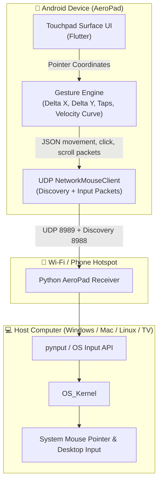
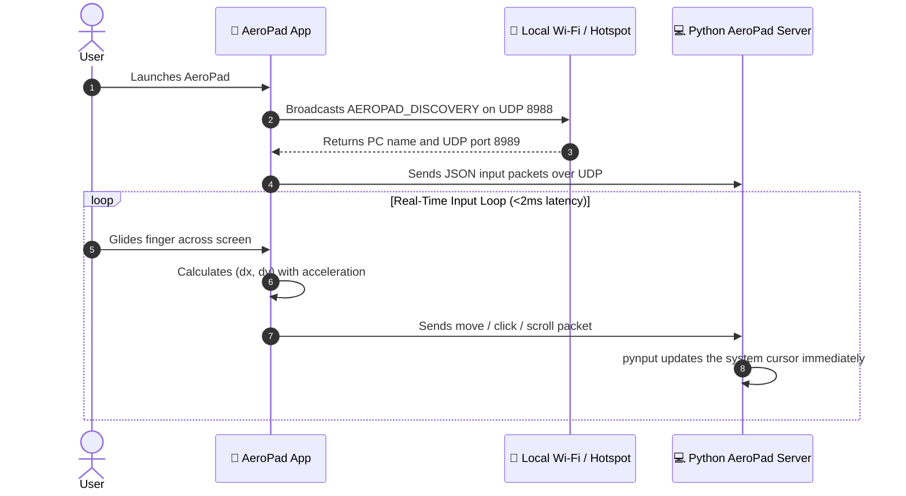

<div align="center">


# 📱 AeroPad
### Turn your Android smartphone into a high-precision, ultra-low-latency Wi-Fi trackpad & mouse.

---

[-3DDC84?style=for-the-badge&logo=android&logoColor=white)](https://developer.android.com)
[](https://flutter.dev)
[](https://en.wikipedia.org/wiki/User_Datagram_Protocol)
[-22C55E?style=for-the-badge&logo=python&logoColor=white)](server/aeropad_server.py)
[](LICENSE)

<br/>

[Features](#-key-features) •
[Interface](#-interface-preview) •
[Why AeroPad?](#-why-aeropad-vs-traditional-solutions) •
[Architecture](#-system-architecture) •
[Gestures](#-touchpad-gestures--controls) •
[Quick Start](#-quick-start-guide) •
[Roadmap](#-development-roadmap)

</div>

---

## 📱 Interface Preview

<div align="center">
  
  <p><em>Official AeroPad Cyber-Minimalist Trackpad Interface — Clean, distraction-free, maximum touch surface.</em></p>
</div>

---

## 💡 Overview

**AeroPad** transforms your Android smartphone into an ultra-low-latency virtual trackpad and mouse. The Flutter client dispatches compact, lightweight UDP input packets over your local Wi-Fi or mobile hotspot directly to a companion Python receiver running on your computer.

The receiver utilizes native OS input simulation (`pynput`) to execute cursor movement, button clicks, double-tap dragging, and smooth sub-pixel scrolling with 1–5ms latency. Multi-subnet auto-discovery probes active network interfaces to pair your phone and PC effortlessly.

---

## ⚡ Key Features

- **🖥️ Zero-Install Companion:** A single, lightweight Python script (`aeropad_server.py`) requiring only `pynput`; no bulky executables or installer wizards.
- **📡 Multi-Subnet Auto-Discovery:** Automatically scans across Wi-Fi subnets and mobile hotspot gateways (`192.168.0.x`, `192.168.137.x`), bypassing router AP isolation blocks.
- **⚡ Ultra-Low Latency (1–5 ms):** High-frequency UDP datagrams stream directly on port `8989` with minimal overhead.
- **🎯 Ballistic Cursor Acceleration:** Fluid cursor gliding modeled after premium laptop trackpads with dynamic velocity curves.
- **🖐️ Precision Multi-Touch Gestures:** Smooth 2-finger scrolling with live direction inversion toggle, tap-to-click, and double-tap drag-and-drop.
- **📳 Haptic Touch Engine:** Satisfying tactile micro-vibrations emulate physical mouse actuation.
- **🎨 Cyber-Minimalist Dark Aesthetic:** OLED-friendly deep void black theme with custom adaptive app icon and live connection status beacon.

---

## 🥊 Why AeroPad? vs Traditional Solutions

| Feature | Traditional Apps (Remote Mouse, Unified Remote, Monect) | 📱 **AeroPad (Wi-Fi UDP)** |
| :--- | :--- | :--- |
| **PC Companion Setup** | ❌ Heavy, proprietary `.exe` installers with ads | 🟢 **Single clean Python script (Open Source)** |
| **Network Flexibility** | ⚠️ Often requires complex manual IP configuration | 🟢 **Subnet broadcast + 1-tap quick connect** |
| **Latency & Overhead** | ❌ High-latency TCP/HTTP polling | 🟢 **Direct UDP datagrams (1–5 ms latency)** |
| **Cross-Platform Host** | ⚠️ Limited by proprietary desktop server support | 🟢 **Windows, macOS, and Linux out-of-the-box** |
| **Privacy & Security** | ❌ Cloud account login, ads, and telemetry | 🟢 **100% Local LAN, zero telemetry, zero accounts** |

---

## 📐 System Architecture

### High-Level Data Flow



### Communication Sequence



---

## 📦 UDP Input Protocol

The phone sends compact JSON datagrams to the Python receiver on UDP port `8989`:

```
+----------------+----------------+----------------+----------------+
|  Byte 0 (Btns) |  Byte 1 (dx)   |  Byte 2 (dy)   | Byte 3 (Wheel) |
+----------------+----------------+----------------+----------------+
| 7 6 5 4 3 2 1 0| 7 6 5 4 3 2 1 0| 7 6 5 4 3 2 1 0| 7 6 5 4 3 2 1 0|
+----------------+----------------+----------------+----------------+
  │ │ │ │ │ │ │ └── Bit 0: Left Click (1 = Pressed, 0 = Released)
  │ │ │ │ │ │ └──── Bit 1: Right Click (1 = Pressed, 0 = Released)
  │ │ │ │ │ └────── Bit 2: Middle Click (1 = Pressed, 0 = Released)
  └─┴─┴─┴─┴──────── Bits 3-7: Reserved (Padding)
```

| Byte | Field | Data Type | Range | Description |
| :--- | :--- | :--- | :--- | :--- |
| **0** | `buttons` | `uint8` | `0x00 - 0x07` | Bitmask for Left (0x01), Right (0x02), and Middle (0x04) buttons |
| **1** | `deltaX` | `int8` | `-127 to +127` | Relative horizontal movement (Two's complement signed integer) |
| **2** | `deltaY` | `int8` | `-127 to +127` | Relative vertical movement (Two's complement signed integer) |
| **3** | `wheel` | `int8` | `-127 to +127` | Vertical scroll amount (positive = scroll up, negative = down) |

---

## 🖐️ Touchpad Gestures & Controls

| Gesture | Action | Visual Representation |
| :--- | :--- | :---: |
| **1-Finger Glide** | Fluid cursor movement with dynamic acceleration | 👆 ➔ 🖱️ |
| **Single Tap** | Left Mouse Click | 👆 |
| **2-Finger Tap** | Right Mouse Click (Context Menu) | ✌️ |
| **2-Finger Vertical Drag** | Smooth natural scrolling (Webpages, documents) | ✌️ ↕️ |
| **Double Tap & Hold** | Drag and drop (rearrange windows, select text) | 👆👆 ✊ |
| **Bottom Left Button** | Dedicated physical-style Left Click zone | ⏹️ Left |
| **Bottom Right Button** | Dedicated physical-style Right Click zone | ⏹️ Right |
| **Volume Up / Down** | Hardware Click triggers | 🔊 Click |

---

## 💻 Host Compatibility Matrix

AeroPad works with computers that can run Python and `pynput`:

- 🪟 **Windows:** Windows 10, Windows 11 (Works on locked corporate workstations and login screens)
- 🍎 **macOS:** macOS Catalina, Big Sur, Monterey, Ventura, Sonoma, Sequoia
- 🐧 **Linux:** Ubuntu, Fedora, Debian, Arch Linux (Native BlueZ HID support)
- 🌐 **ChromeOS:** Chromebooks & Chromeboxes
- 🍓 **Single Board Computers:** Raspberry Pi OS with a desktop session

---

## 🚀 Pairing & Quick Start Guide

1. **Prerequisites:**
   - Android smartphone running **Android 8.0 (Oreo / API 26) or higher**.
   - Python 3.9+ on the host computer.
   - Phone and computer on the same Wi-Fi network, or computer connected to the phone hotspot.

2. **Start the PC companion server:**
   ```bash
   cd server
   pip install -r requirements.txt
   python aeropad_server.py
   ```

3. **Launch the AeroPad mobile app:**
   1. Connect your phone to the same Wi-Fi or laptop mobile hotspot.
   2. Open **AeroPad**. The top status beacon will glow Amber (Searching) and automatically switch to Green (Connected) when your PC is detected.
   3. If auto-discovery is blocked by strict router AP isolation, tap Settings (⚙️) and tap **Connect to PC on Wi-Fi** or enter the IP manually.

---

## 🛠️ Development & Build Setup

This repository is built with Flutter and Python:
- **Mobile Client**: Flutter renders the UI at up to 120 FPS and streams low-latency UDP packets.
- **Companion Server**: Python with `pynput` converts incoming UDP packets into native OS mouse events.

```bash
# Get Flutter dependencies
flutter pub get

# Run code analysis
flutter analyze

# Run unit & widget tests
flutter test

# Build debug APK
flutter build apk --debug

# Build optimized production release APK
flutter build apk --release
```

---

## 🏗️ Project Structure

```text
AeroPad/
├── android/                                    # Native Android wrapper & launcher assets
│   ├── app/src/main/kotlin/                    # MulticastLock & native lifecycle
│   └── app/src/main/res/                       # Adaptive launcher icons & mipmaps
├── lib/
│   └── main.dart                               # Flutter UI, gesture engine & UDP client
├── server/
│   ├── aeropad_server.py                       # Python UDP receiver & mouse controller
│   └── requirements.txt                        # Host dependencies (pynput)
├── test/
│   └── widget_test.dart                        # Flutter test suite
├── docs/
│   ├── Project_Abstract.docx                   # Project abstract & research paper
│   ├── OPENCODE_ACTION_PROMPT.md               # Architecture implementation prompts
│   └── RESEARCH_AND_ARCHITECTURE.md            # Technical research & benchmarks
├── assets/
│   ├── banner.png                              # Project banner
│   ├── ui.png                                  # Trackpad screenshot
│   ├── app icon.png                            # High-res AeroPad emblem
│   └── app_icon_adaptive_fg.png                # Android adaptive icon foreground
├── pubspec.yaml                                # Flutter dependencies & metadata
├── README.md                                   # Production documentation
└── LICENSE                                     # MIT License
```

---

## 🗺️ Development Roadmap

- [x] High-precision ballistic cursor gliding with velocity scaling
- [x] Ultra-low-latency UDP network transport layer (`port 8989`)
- [x] Multi-subnet broadcast & direct probing auto-discovery (`port 8988`)
- [x] Sub-pixel smooth two-finger scrolling with live direction inversion
- [x] Double-tap-and-hold drag-and-drop gesture engine
- [x] Tactile micro-haptic actuation feedback on clicks
- [x] Dark cyber-minimalist OLED UI with live status indicator beacon
- [x] Android 8.0+ adaptive vector icons with safe-zone insets
- [x] In-app Settings with live parameter synchronization and PopScope safety
- [ ] Air Mouse Mode (Gyroscope / Accelerometer based pointing for presentations)
- [ ] Virtual soft keyboard and media controls extension

---

## 📄 Documentation Files

The repository includes complete research documentation:
- 📑 [**Project_Abstract.docx**](docs/Project_Abstract.docx) — Formal Academic Abstract & Specification
- 📑 [**RESEARCH_AND_ARCHITECTURE.md**](docs/RESEARCH_AND_ARCHITECTURE.md) — Comprehensive Architecture, Protocol Benchmarks & Design Decisions

---

## 🤝 Contributing

Contributions are welcome! Please review [CONTRIBUTING.md](CONTRIBUTING.md) for branch workflows and coding guidelines.

---

## 📜 License

Distributed under the **MIT License**. See [`LICENSE`](LICENSE) for more information.

<div align="center">
Made with ❤️ by <a href="https://github.com/abhi963007">abhi963007</a>
</div>
