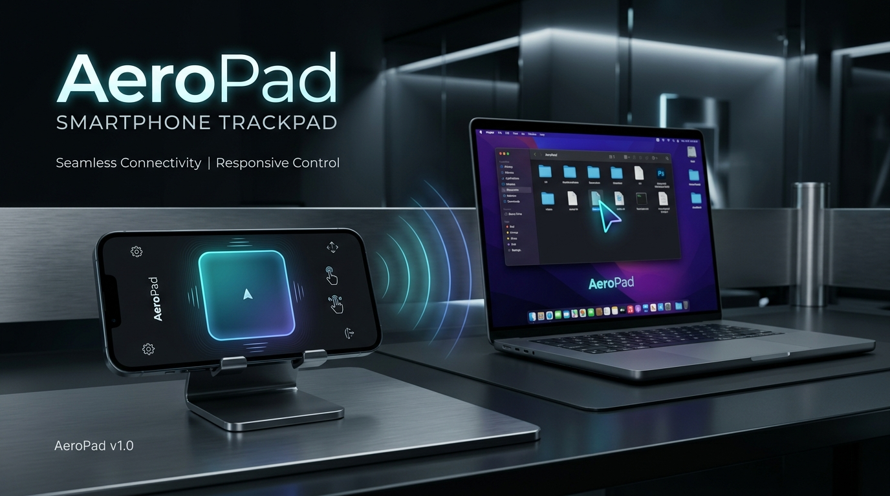
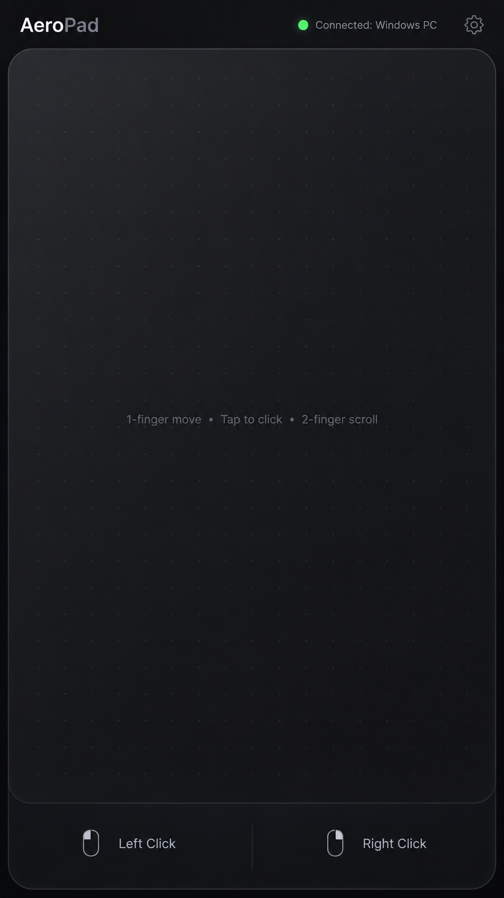
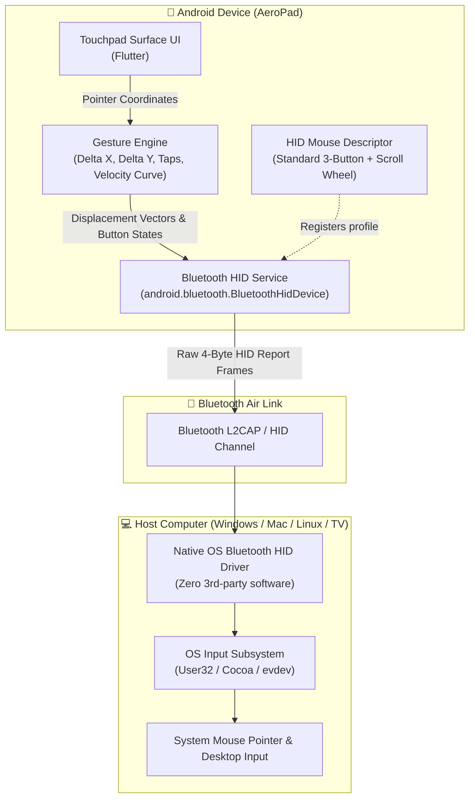
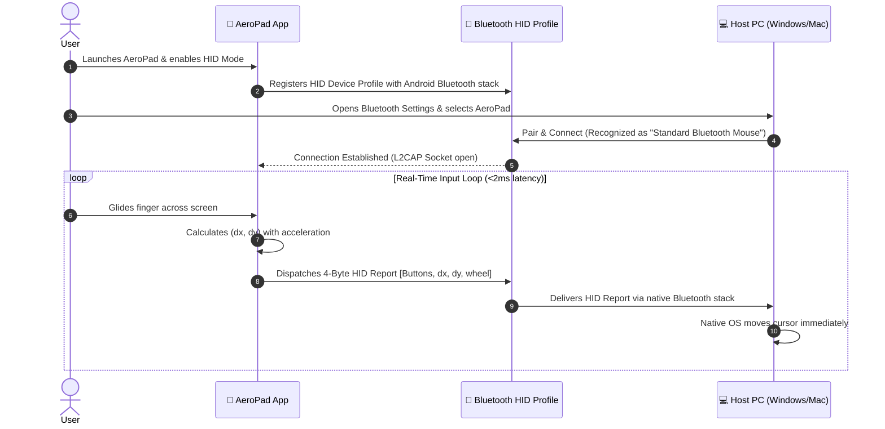

<div align="center">



# 📱 AeroPad
### Turn your Android smartphone into a high-precision, plug-and-play Bluetooth trackpad & mouse — **with ZERO software or servers installed on your PC.**

---

[-3DDC84?style=for-the-badge&logo=android&logoColor=white)](https://developer.android.com)
[](https://flutter.dev)
[](https://kotlinlang.org)
[](https://en.wikipedia.org/wiki/Human_interface_device)
[-22C55E?style=for-the-badge)]()
[](LICENSE)

<br/>

[Features](#-key-features) •
[Interface](#-interface-preview) •
[Why AeroPad?](#-why-aeropad-vs-traditional-solutions) •
[Architecture](#-system-architecture) •
[HID Specifications](#-hid-report-descriptor-specification) •
[Gestures](#-touchpad-gestures--controls) •
[Pairing Guide](#-pairing--quick-start-guide) •
[Roadmap](#-development-roadmap)

</div>

---

## 📱 Interface Preview

<div align="center">
  
  <p><em>Official AeroPad Minimalist Trackpad Interface — Clean, distraction-free, maximum surface area.</em></p>
</div>

---

## 💡 Overview

**AeroPad** transforms your Android device into an ultra-low-latency, hardware-grade virtual trackpad. Unlike conventional "remote mouse" applications that force you to run background server software on your PC and stay on the same Wi-Fi router, **AeroPad emulates a physical Bluetooth Human Interface Device (HID) peripheral directly at the operating system layer**.

When you pair your phone with your computer, the host operating system recognizes your phone **identically to a genuine Bluetooth optical mouse (like Logitech or Microsoft peripherals)**.

---

## ⚡ Key Features

- **🚫 Zero Host Software:** No `.exe`, no background server daemons, and no extra drivers required on your computer.
- **🔌 100% Plug & Play:** Connects via standard Windows / macOS / Linux Bluetooth settings.
- **⚡ Ultra-Low Latency:** Communicates directly over native Bluetooth L2CAP channels, bypassing congested Wi-Fi routers and local firewalls.
- **🏢 Enterprise & Workstation Safe:** Operates flawlessly on restricted corporate laptops, school computers, and public kiosks where installing `.exe` servers is blocked by IT administrators.
- **🎯 Dynamic Cursor Acceleration:** Fluid cursor gliding modeled after high-end laptop trackpads with velocity-based acceleration.
- **🖐️ Natural Multi-Touch Gestures:** Smooth two-finger scrolling, right-click taps, and double-tap-and-hold drag-and-drop.
- **📳 Haptic Touch Engine:** Micro-haptic tactile feedback provides the satisfying sensation of physical mouse button clicks.
- **🔘 Physical Volume Key Triggers:** Use hardware Volume Up / Down buttons as tactile left and right click switches.

---

## 🥊 Why AeroPad? vs Traditional Solutions

| Feature | Traditional Apps (Remote Mouse, Monect, etc.) | 📱 **AeroPad (Bluetooth HID)** |
| :--- | :--- | :--- |
| **PC Companion App** | ❌ Required (heavy background `.exe`) | 🟢 **Zero (Not required at all)** |
| **Wi-Fi Network Required** | ❌ Yes (must share the same Wi-Fi) | 🟢 **No (Direct Bluetooth link)** |
| **Works on Restricted / Office PCs** | ❌ Blocked by IT firewalls & policies | 🟢 **100% Compatible (Recognized as physical mouse)** |
| **Network Latency / Packet Drops** | ❌ Susceptible to Wi-Fi traffic & lag | 🟢 **Sub-millisecond direct radio latency** |
| **Driver / Admin Privileges** | ❌ Requires Admin installation | 🟢 **Zero Admin privileges required on host** |
| **Compatibility** | ⚠️ Needs OS-specific server build | 🟢 **Any Bluetooth-enabled host (PC, Mac, Linux, TV)** |

---

## 📐 System Architecture

### High-Level Data Flow



### Communication Sequence



---

## 📦 HID Report Descriptor Specification

AeroPad registers a compliant USB-IF Human Interface Device descriptor. Every motion and touch action translates into a **compact 4-byte report frame**:

```
+----------------+----------------+----------------+----------------+
|  Byte 0 (Btns) |  Byte 1 (dx)   |  Byte 2 (dy)   | Byte 3 (Wheel) |
+----------------+----------------+----------------+----------------+
| 7 6 5 4 3 2 1 0| 7 6 5 4 3 2 1 0| 7 6 5 4 3 2 1 0| 7 6 5 4 3 2 1 0|
+----------------+----------------+----------------+----------------+
  │ │ │ │ │ │ │ └── Bit 0: Left Click (1 = Pressed, 0 = Released)
  │ │ │ │ │ │ └──── Bit 1: Right Click (1 = Pressed, 0 = Released)
  │ │ │ │ │ └────── Bit 2: Middle Click (1 = Pressed, 0 = Released)
  └─┴─┴─┴─┴──────── Bits 3-7: Reserved (Padding)
```

| Byte | Field | Data Type | Range | Description |
| :--- | :--- | :--- | :--- | :--- |
| **0** | `buttons` | `uint8` | `0x00 - 0x07` | Bitmask for Left (0x01), Right (0x02), and Middle (0x04) buttons |
| **1** | `deltaX` | `int8` | `-127 to +127` | Relative horizontal movement (Two's complement signed integer) |
| **2** | `deltaY` | `int8` | `-127 to +127` | Relative vertical movement (Two's complement signed integer) |
| **3** | `wheel` | `int8` | `-127 to +127` | Vertical scroll amount (positive = scroll up, negative = down) |

---

## 🖐️ Touchpad Gestures & Controls

| Gesture | Action | Visual Representation |
| :--- | :--- | :---: |
| **1-Finger Glide** | Fluid cursor movement with dynamic acceleration | 👆 ➔ 🖱️ |
| **Single Tap** | Left Mouse Click | 👆 |
| **2-Finger Tap** | Right Mouse Click (Context Menu) | ✌️ |
| **2-Finger Vertical Drag** | Smooth natural scrolling (Webpages, documents) | ✌️ ↕️ |
| **Double Tap & Hold** | Drag and drop (rearrange windows, select text) | 👆👆 ✊ |
| **Bottom Left Button** | Dedicated physical-style Left Click zone | ⏹️ Left |
| **Bottom Right Button** | Dedicated physical-style Right Click zone | ⏹️ Right |
| **Volume Up / Down** | Hardware Click triggers | 🔊 Click |

---

## 💻 Host Compatibility Matrix

AeroPad conforms to the universal Bluetooth HID standard, making it natively compatible with virtually any Bluetooth-enabled device:

- 🪟 **Windows:** Windows 10, Windows 11 (Works on locked corporate workstations and login screens)
- 🍎 **macOS:** macOS Catalina, Big Sur, Monterey, Ventura, Sonoma, Sequoia
- 🐧 **Linux:** Ubuntu, Fedora, Debian, Arch Linux (Native BlueZ HID support)
- 🌐 **ChromeOS:** Chromebooks & Chromeboxes
- 📺 **Smart TVs & Media Centers:** Android TV, Google TV, Apple TV, Fire TV, WebOS
- 🍓 **Single Board Computers:** Raspberry Pi OS

---

## 🚀 Pairing & Quick Start Guide

1. **Prerequisites:**
   - Android smartphone running **Android 9.0 (Pie / API 28) or higher**.
   - Host PC/Laptop with built-in Bluetooth or USB Bluetooth dongle.

2. **Step-by-Step Connection:**
   1. Open **AeroPad** on your smartphone.
   2. Turn on **Bluetooth** when prompted.
   3. The app will register the HID profile and make the phone discoverable.
   4. On your PC, navigate to:
      - **Windows:** `Settings` ➔ `Bluetooth & devices` ➔ `Add device` ➔ `Bluetooth`.
      - **macOS:** `System Settings` ➔ `Bluetooth`.
   5. Select **AeroPad** from the list of available devices.
   6. Confirm pairing. Once connected, your phone's screen immediately starts controlling the computer cursor!

## 🛠️ Development Setup

This repository is a Flutter Android application. Flutter renders the interface and handles gestures; the Android Kotlin layer exposes the native `BluetoothHidDevice` API through `com.aeropad/hid` and `com.aeropad/hid_state` platform channels.

```bash
flutter pub get
flutter analyze
flutter test
flutter build apk --debug
```

The debug APK is generated at `build/app/outputs/flutter-apk/app-debug.apk`.

Android Studio or the Android SDK is required for APK builds. Bluetooth HID behavior must be tested on a physical Android 9+ device because emulators do not provide the required HID peripheral profile.

---

## 🏗️ Project Structure

```text
AeroPad/
├── android/
│   └── app/src/main/kotlin/com/aeropad/aeropad/
│       └── MainActivity.kt                    # Flutter MethodChannel + Bluetooth HID bridge
├── lib/
│   └── main.dart                               # Flutter UI, gestures, and HID calls
├── test/
│   └── widget_test.dart                        # Flutter widget smoke tests
├── Project_Abstract.docx                       # Full research specifications
├── Project_Abstract.doc
├── assets/
│   └── banner.png                             # Project visual banner
├── pubspec.yaml                                # Flutter dependencies and app metadata
├── README.md
├── LICENSE
└── .gitignore
```

---

## 🗺️ Development Roadmap

- [x] Concept & Architectural Design
- [x] Standard HID Mouse Report Descriptor formulation
- [x] Project Abstract & Technical Documentation
- [x] Flutter Android project scaffolding
- [x] `BluetoothHidDevice` registration & state callback pipeline
- [x] Flutter touchpad surface and dark AeroPad interface
- [x] Two-finger scroll & acceleration algorithms
- [ ] Double-tap-and-hold drag-and-drop gesture
- [ ] Volume key click triggers
- [ ] Settings panel for sensitivity and acceleration
- [ ] Air Mouse Mode (Gyroscope / Accelerometer based pointing for presentations)
- [ ] Keyboard input extension (HID Keyboard profile integration)

---

## 📄 Documentation Files

The repository includes complete technical specifications and formal project documents:
- 📑 [**Project_Abstract.docx**](Project_Abstract.docx) - Formatted Microsoft Word Document
- 📑 [**Project_Abstract.doc**](Project_Abstract.doc) - Legacy Word Document

---

## 🤝 Contributing

Contributions are welcome! If you have suggestions, feature requests, or bug reports, feel free to open an issue or submit a pull request.

1. Fork the Project
2. Create your Feature Branch (`git checkout -b feature/AmazingFeature`)
3. Commit your Changes (`git commit -m 'Add some AmazingFeature'`)
4. Push to the Branch (`git push origin feature/AmazingFeature`)
5. Open a Pull Request

---

## 📜 License

Distributed under the **MIT License**. See [`LICENSE`](LICENSE) for more information.

<div align="center">
Made with ❤️ by <a href="https://github.com/abhi963007">abhi963007</a>
</div>
