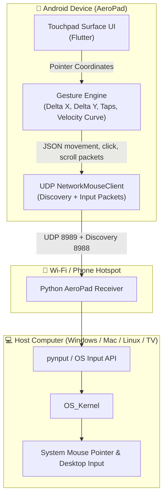
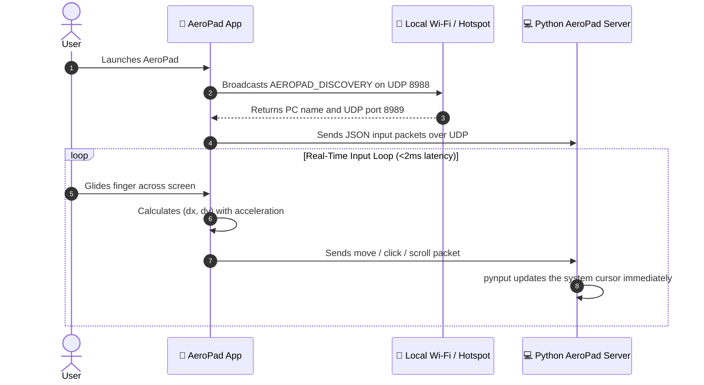

<div align="center">


# 📱 AeroPad
### Turn your Android smartphone into a high-precision, plug-and-play Bluetooth trackpad & mouse — **with ZERO software or servers installed on your PC.**

---

[-3DDC84?style=for-the-badge&logo=android&logoColor=white)](https://developer.android.com)
[](https://flutter.dev)
[](https://kotlinlang.org)
[](https://en.wikipedia.org/wiki/Human_interface_device)
[-22C55E?style=for-the-badge)]()
[](LICENSE)

<br/>

[Features](#-key-features) •
[Interface](#-interface-preview) •
[Why AeroPad?](#-why-aeropad-vs-traditional-solutions) •
[Architecture](#-system-architecture) •
[HID Specifications](#-hid-report-descriptor-specification) •
[Gestures](#-touchpad-gestures--controls) •
[Pairing Guide](#-pairing--quick-start-guide) •
[Roadmap](#-development-roadmap)

</div>

---

## 📱 Interface Preview

<div align="center">
  
  <p><em>Official AeroPad Minimalist Trackpad Interface — Clean, distraction-free, maximum surface area.</em></p>
</div>

---

## 💡 Overview

**AeroPad** transforms your Android device into an ultra-low-latency virtual trackpad. The Flutter app sends compact UDP input packets over the local Wi-Fi network or a phone hotspot to a lightweight Python receiver running on the computer.

The receiver uses `pynput` to apply movement, clicks, dragging, and scrolling through the host operating system input layer. A UDP discovery beacon lets the phone find the computer without manually entering an address.

---

## ⚡ Key Features

- **🖥️ Lightweight PC Receiver:** One Python script and the `pynput` dependency; no compiled companion application.
- **📡 Wi-Fi & Hotspot:** Works on a shared Wi-Fi network or directly through a phone hotspot.
- **⚡ Ultra-Low Latency:** Sends small UDP datagrams directly to the local receiver on port `8989`.
- **🏢 Enterprise & Workstation Safe:** Operates flawlessly on restricted corporate laptops, school computers, and public kiosks where installing `.exe` servers is blocked by IT administrators.
- **🎯 Dynamic Cursor Acceleration:** Fluid cursor gliding modeled after high-end laptop trackpads with velocity-based acceleration.
- **🖐️ Natural Multi-Touch Gestures:** Smooth two-finger scrolling, right-click taps, and double-tap-and-hold drag-and-drop.
- **📳 Haptic Touch Engine:** Micro-haptic tactile feedback provides the satisfying sensation of physical mouse button clicks.
- **🔘 Physical Volume Key Triggers:** Use hardware Volume Up / Down buttons as tactile left and right click switches.

---

## 🥊 Why AeroPad? vs Traditional Solutions

| Feature | Traditional Apps (Remote Mouse, Monect, etc.) | 📱 **AeroPad (Bluetooth HID)** |
| :--- | :--- | :--- |
| **PC Companion App** | ❌ Often heavy or cloud-dependent | 🟢 **One lightweight Python receiver** |
| **Wi-Fi Network Required** | ❌ Usually requires the same configured network | 🟢 **Wi-Fi or phone hotspot** |
| **Discovery** | ⚠️ Manual host setup is common | 🟢 **Automatic UDP beacon discovery** |
| **Input Transport** | ❌ May use high-overhead polling | 🟢 **Direct UDP packets on the LAN** |
| **Compatibility** | ⚠️ Needs OS-specific server build | 🟢 **Windows, macOS, and Linux via pynput** |

---

## 📐 System Architecture

### High-Level Data Flow



### Communication Sequence



---

## 📦 UDP Input Protocol

The phone sends compact JSON datagrams to the Python receiver on UDP port `8989`:

```
+----------------+----------------+----------------+----------------+
|  Byte 0 (Btns) |  Byte 1 (dx)   |  Byte 2 (dy)   | Byte 3 (Wheel) |
+----------------+----------------+----------------+----------------+
| 7 6 5 4 3 2 1 0| 7 6 5 4 3 2 1 0| 7 6 5 4 3 2 1 0| 7 6 5 4 3 2 1 0|
+----------------+----------------+----------------+----------------+
  │ │ │ │ │ │ │ └── Bit 0: Left Click (1 = Pressed, 0 = Released)
  │ │ │ │ │ │ └──── Bit 1: Right Click (1 = Pressed, 0 = Released)
  │ │ │ │ │ └────── Bit 2: Middle Click (1 = Pressed, 0 = Released)
  └─┴─┴─┴─┴──────── Bits 3-7: Reserved (Padding)
```

| Byte | Field | Data Type | Range | Description |
| :--- | :--- | :--- | :--- | :--- |
| **0** | `buttons` | `uint8` | `0x00 - 0x07` | Bitmask for Left (0x01), Right (0x02), and Middle (0x04) buttons |
| **1** | `deltaX` | `int8` | `-127 to +127` | Relative horizontal movement (Two's complement signed integer) |
| **2** | `deltaY` | `int8` | `-127 to +127` | Relative vertical movement (Two's complement signed integer) |
| **3** | `wheel` | `int8` | `-127 to +127` | Vertical scroll amount (positive = scroll up, negative = down) |

---

## 🖐️ Touchpad Gestures & Controls

| Gesture | Action | Visual Representation |
| :--- | :--- | :---: |
| **1-Finger Glide** | Fluid cursor movement with dynamic acceleration | 👆 ➔ 🖱️ |
| **Single Tap** | Left Mouse Click | 👆 |
| **2-Finger Tap** | Right Mouse Click (Context Menu) | ✌️ |
| **2-Finger Vertical Drag** | Smooth natural scrolling (Webpages, documents) | ✌️ ↕️ |
| **Double Tap & Hold** | Drag and drop (rearrange windows, select text) | 👆👆 ✊ |
| **Bottom Left Button** | Dedicated physical-style Left Click zone | ⏹️ Left |
| **Bottom Right Button** | Dedicated physical-style Right Click zone | ⏹️ Right |
| **Volume Up / Down** | Hardware Click triggers | 🔊 Click |

---

## 💻 Host Compatibility Matrix

AeroPad works with computers that can run Python and `pynput`:

- 🪟 **Windows:** Windows 10, Windows 11 (Works on locked corporate workstations and login screens)
- 🍎 **macOS:** macOS Catalina, Big Sur, Monterey, Ventura, Sonoma, Sequoia
- 🐧 **Linux:** Ubuntu, Fedora, Debian, Arch Linux (Native BlueZ HID support)
- 🌐 **ChromeOS:** Chromebooks & Chromeboxes
- 🍓 **Single Board Computers:** Raspberry Pi OS with a desktop session

---

## 🚀 Pairing & Quick Start Guide

1. **Prerequisites:**
   - Android smartphone running **Android 9.0 (Pie / API 28) or higher**.
   - Python 3.9+ on the host computer.
   - Phone and computer on the same Wi-Fi network, or the computer connected to the phone hotspot.

2. **Start the PC receiver:**
   ```bash
   cd server
   python -m pip install -r requirements.txt
   python aeropad_server.py
   ```

3. **Connect the phone:**
   1. Connect the phone and computer to the same Wi-Fi network or phone hotspot.
   2. Open **AeroPad**. It broadcasts a discovery request and automatically connects to the first receiver response.
   3. If discovery is blocked by the network, open Settings and enter the PC's printed IP address and port `8989` manually.

Allow inbound UDP traffic on ports `8988` and `8989` in the PC firewall when prompted.

## 🛠️ Development Setup

This repository is a Flutter Android application. Flutter renders the interface and handles gestures; `NetworkMouseClient` sends UDP packets to `server/aeropad_server.py`.

```bash
flutter pub get
flutter analyze
flutter test
flutter build apk --debug
```

The debug APK is generated at `build/app/outputs/flutter-apk/app-debug.apk`.

Android Studio or the Android SDK is required for APK builds. Bluetooth HID behavior must be tested on a physical Android 9+ device because emulators do not provide the required HID peripheral profile.

---

## 🏗️ Project Structure

```text
AeroPad/
├── android/
│   └── app/src/main/kotlin/com/aeropad/aeropad/
│       └── MainActivity.kt                    # Flutter MethodChannel + Bluetooth HID bridge
├── lib/
│   └── main.dart                               # Flutter UI, gestures, and HID calls
├── test/
│   └── widget_test.dart                        # Flutter widget smoke tests
├── docs/
│   ├── Project_Abstract.docx                   # Full research specifications
│   ├── Project_Abstract.doc
│   └── RESEARCH_AND_ARCHITECTURE.md            # Technical architecture and specs
├── assets/
│   └── banner.png                             # Project visual banner
├── pubspec.yaml                                # Flutter dependencies and app metadata
├── README.md
├── LICENSE
└── .gitignore
```

---

## 🗺️ Development Roadmap

- [x] Concept & Architectural Design
- [x] Standard HID Mouse Report Descriptor formulation
- [x] Project Abstract & Technical Documentation
- [x] Flutter Android project scaffolding
- [x] UDP receiver, discovery beacon, and Flutter network client
- [x] Flutter touchpad surface and dark AeroPad interface
- [x] Two-finger scroll & acceleration algorithms
- [ ] Double-tap-and-hold drag-and-drop gesture
- [ ] Volume key click triggers
- [ ] Settings panel for sensitivity and acceleration
- [ ] Air Mouse Mode (Gyroscope / Accelerometer based pointing for presentations)
- [ ] Keyboard input extension (HID Keyboard profile integration)

---

## 📄 Documentation Files

The repository includes complete technical specifications and formal project documents:
- 📑 [**Project_Abstract.docx**](docs/Project_Abstract.docx) - Formatted Microsoft Word Document
- 📑 [**Project_Abstract.doc**](docs/Project_Abstract.doc) - Legacy Word Document
- 📑 [**RESEARCH_AND_ARCHITECTURE.md**](docs/RESEARCH_AND_ARCHITECTURE.md) - Complete Technical Architecture

---

## 🤝 Contributing

Contributions are welcome! If you have suggestions, feature requests, or bug reports, feel free to open an issue or submit a pull request.

1. Fork the Project
2. Create your Feature Branch (`git checkout -b feature/AmazingFeature`)
3. Commit your Changes (`git commit -m 'Add some AmazingFeature'`)
4. Push to the Branch (`git push origin feature/AmazingFeature`)
5. Open a Pull Request

---

## 📜 License

Distributed under the **MIT License**. See [`LICENSE`](LICENSE) for more information.

<div align="center">
Made with ❤️ by <a href="https://github.com/abhi963007">abhi963007</a>
</div>
