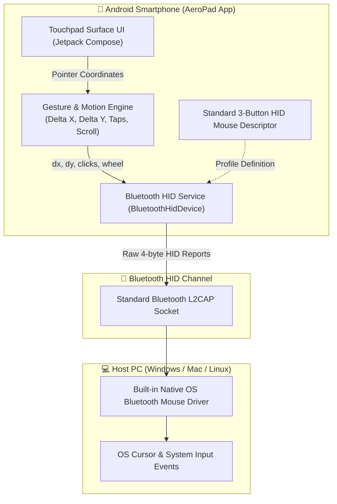

# 📱 AeroPad - Serverless Android Bluetooth HID Trackpad

[-3DDC84.svg?style=flat&logo=android)](https://developer.android.com)

[-success.svg?style=flat)]()

> Turn any Android smartphone into a high-precision, plug-and-play wireless trackpad and mouse for Windows, macOS, Linux, and Smart TVs — **with ZERO companion software or servers on your PC!**

---

## 🌟 Key Highlights

- **🚫 Zero PC Software / Serverless:** No `.exe`, no background server, no driver installation on the PC.
- **🔌 100% Plug & Play:** Connects directly via standard OS Bluetooth settings. The computer recognizes the phone as a native hardware mouse.
- **⚡ Sub-millisecond Latency:** Bypasses Wi-Fi networks and router firewalls; sends raw HID packets straight over Bluetooth L2CAP.
- **🏢 Enterprise & Workstation Friendly:** Works seamlessly on locked-down office PCs and kiosks where installing third-party software is restricted.
- **📳 Haptic Click Feedback:** Subtle micro-vibrations emulate physical mouse clicks.

---

## 📐 Architecture

---

## 📦 HID Report Packet Specification

AeroPad dispatches industry-standard 4-byte mouse report frames via `BluetoothHidDevice.sendReport()`:

| Byte | Field | Range / Format | Description |
| :--- | :--- | :--- | :--- |
| **Byte 0** | Buttons | `0x00` - `0x07` | Bitmask: Bit 0 = Left Click, Bit 1 = Right Click, Bit 2 = Middle Click |
| **Byte 1** | Delta X | `-127` to `+127` | Relative horizontal cursor displacement (signed 8-bit int) |
| **Byte 2** | Delta Y | `-127` to `+127` | Relative vertical cursor displacement (signed 8-bit int) |
| **Byte 3** | Wheel | `-127` to `+127` | Vertical scroll wheel increments |

---

## 🖐️ Gestures & Controls

| Gesture | Action |
| :--- | :--- |
| **1-Finger Drag** | Smooth cursor movement with velocity acceleration |
| **Single Tap** | Left Mouse Click |
| **2-Finger Tap** | Right Mouse Click (Context Menu) |
| **2-Finger Drag (Vertical)** | Natural Vertical Scroll |
| **Double-Tap & Hold** | Drag and Drop (window moving, text selection) |
| **Dedicated Bottom Buttons** | Left and Right click buttons |

---

## 📄 Documentation

For full research details, methodology, and project specs, refer to:
- [`Project_Abstract.docx`](Project_Abstract.docx) - Formatted Word Document
- [`Project_Abstract.doc`](Project_Abstract.doc) - Legacy Word Document

---

## 🛠️ Tech Stack

- **Platform:** Android 9.0+ (API Level 28+)
- **Language:** Kotlin
- **UI Framework:** Jetpack Compose
- **Bluetooth Stack:** `android.bluetooth.BluetoothHidDevice`
- **Host Support:** Windows 10/11, macOS, Linux, ChromeOS, Android TV

---

## 📄 License

This project is licensed under the [MIT License](LICENSE).
